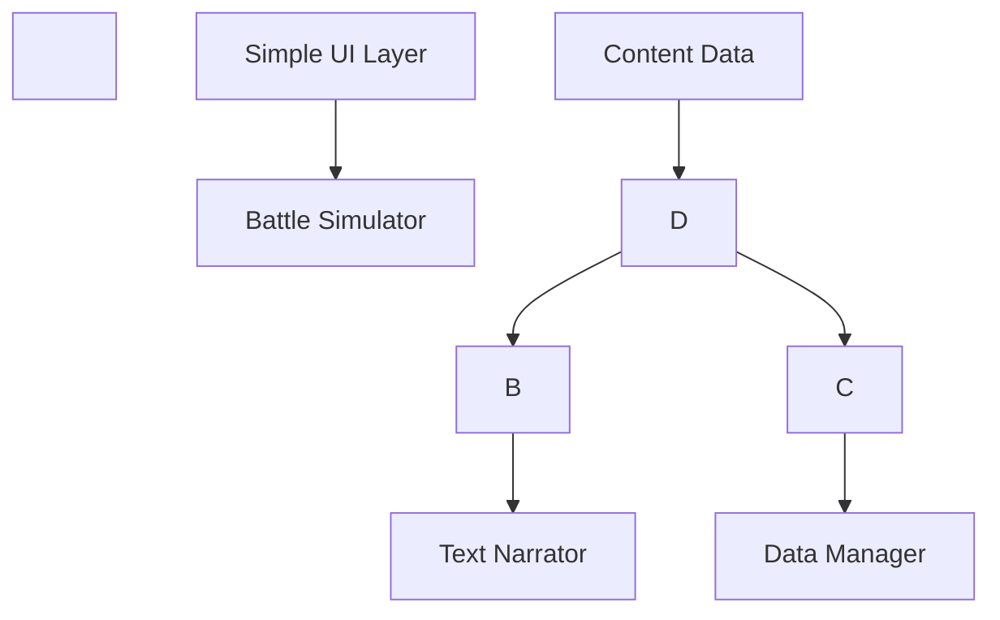

\# 📜 Project Specification: Wuxia Text-Based Battle Game - 千文传 (Revised v2)


\## 🎯 Project Overview


\### Objective

Develop an MVP Battle Simulator for a text-based Wuxia battle game with an auto-solving battle system and dynamic narrative commentary. The simulator will focus on creating immersive battle experiences through pre-written narrative fragments that make battles feel like reading a Wuxia novel.


\*\*Core Vision\*\*: Create a battle system where players experience combat through rich, novel-like narration rather than visual effects. The MVP will be a standalone battle simulator that can later be integrated into a full game.


\*\*Current Focus\*\*: MVP Battle Simulator  

We are prioritizing the development of a battle simulator as the first deliverable. The simulator will generate rich text-based combat experiences with detailed narrative commentary, living up to its name "千文传" (Thousand Texts Saga).


\### Target Platforms

\- Windows

\- Linux

\- macOS


\### Distribution

Steam platform with cross-platform builds (for future full game release).


---


\## 🏗️ System Architecture (MVP)


\### Core Components




\### Data Flow

1\. \*\*Data Manager\*\* loads character, skill, and template data from JSON files

2\. \*\*Battle Simulator\*\* processes battle mechanics and generates structured battle events

3\. \*\*Text Narrator\*\* selects appropriate templates based on events and generates narrative text

4\. \*\*Simple UI Layer\*\* displays the narrative text and basic battle information in a web-like interface


---


\## ⚔️ Battle Simulator System


\### Core Concept

The Battle Simulator is a background simulation engine that resolves battles using an Active Time Battle (ATB) system. It generates a sequence of structured battle events that contain all necessary information for the Text Narrator to create immersive descriptions.


\### Technical Implementation Details


\#### ATB System Algorithm

```

function ATB\_System(characters):

&nbsp;   Initialize time\_units for each character based on agility

&nbsp;   battle\_events = \[]

&nbsp;   while battle not concluded:

&nbsp;       Find character with highest time\_units (≥100)

&nbsp;       Select action for character (AI decision based on available skills)

&nbsp;       Calculate action outcome (hit/miss, damage, etc.)

&nbsp;       Generate battle event with all relevant data

&nbsp;       Add event to battle\_events list

&nbsp;       Reset character's time\_units

&nbsp;       Increment time\_units for all characters based on agility

&nbsp;   return battle\_events

```


\#### Battle Event Structure

Each battle event will be a dictionary with the following structure:

```python

{

&nbsp;   "timestamp": float,           # Time in battle when event occurred

&nbsp;   "event\_type": str,             # "attack", "defend", "dodge", "critical", "status\_effect"

&nbsp;   "actor": str,                  # Character ID performing action

&nbsp;   "target": str,                 # Character ID receiving action (if applicable)

&nbsp;   "skill\_id": str,               # ID of skill used

&nbsp;   "skill\_tier": int,             # Tier of skill used

&nbsp;   "outcome": str,                 # "hit", "miss", "blocked", "critical"

&nbsp;   "damage": int,                 # Amount of damage dealt (if applicable)

&nbsp;   "damage\_percent": str,         # "low", "medium", "high" based on target's max HP

&nbsp;   "remaining\_hp\_percent": float, # Target's remaining HP as percentage

&nbsp;   "qi\_cost": int,                # Qi consumed by the action

&nbsp;   "cooldown\_remaining": int      # Cooldown turns remaining for the skill

}

```


\#### Damage Calculation Formula

```

base\_damage = (actor.strength \* skill.power\_multiplier) + (skill.base\_damage)

defense\_reduction = target.defense \* 0.5

final\_damage = max(1, base\_damage - defense\_reduction)


\# Critical hit calculation

if random() < (skill.critical\_chance + (actor.agility \* 0.01)):

&nbsp;   final\_damage = final\_damage \* 1.5

&nbsp;   outcome = "critical"

else:

&nbsp;   outcome = "hit"


\# Hit/miss calculation

if random() > (skill.hit\_chance + (actor.agility \* 0.02) - (target.agility \* 0.01)):

&nbsp;   outcome = "miss"

&nbsp;   final\_damage = 0

```


---


\## 📜 Text Narrator System


\### Core Purpose

The Text Narrator transforms structured battle events into immersive narrative commentary by selecting and filling pre-written templates. It creates a cohesive battle narrative that reads like a Wuxia novel.


\### Technical Implementation Details


\#### Template Selection Algorithm

```

function select\_template(battle\_event):

&nbsp;   # Filter templates by narrative\_type matching event\_type

&nbsp;   candidate\_templates = \[t for t in templates if t.narrative\_type == battle\_event.event\_type]

&nbsp;   

&nbsp;   # Further filter by conditions

&nbsp;   matching\_templates = \[]

&nbsp;   for template in candidate\_templates:

&nbsp;       if all(condition\_met(battle\_event, condition) for condition in template.conditions):

&nbsp;           matching\_templates.append(template)

&nbsp;   

&nbsp;   # Randomly select from matching templates

&nbsp;   if matching\_templates:

&nbsp;       return random.choice(matching\_templates)

&nbsp;   else:

&nbsp;       return get\_default\_template(battle\_event.event\_type)

```


\#### Variable Replacement System

The system will replace the following variables in templates:

\- `{attacker}`: Name of the character performing the action

\- `{target}`: Name of the character receiving the action

\- `{skill}`: Name of the skill used

\- `{tier\_name}`: Name of the skill tier

\- `{damage}`: Amount of damage dealt

\- `{faction}`: Faction of the character

\- `{hp\_percent}`: Remaining HP percentage of the target

\- `{location}`: Battle location (for future expansion)


\#### Narrative Flow Enhancement

To improve narrative flow between events:

1\. Add connective phrases between related events

2\. Vary sentence structure and length

3\. Include contextual descriptions based on battle state

4\. Use faction-specific terminology when appropriate


---


\## 📋 Data Schemas


\### Character Data Schema

```json

{

&nbsp; "id": "char\_001",

&nbsp; "name": "李三",

&nbsp; "level": 10,

&nbsp; "faction": "华山派",

&nbsp; "faction\_terminology": {

&nbsp;   "attack\_prefix": "剑法",

&nbsp;   "defense\_prefix": "剑盾",

&nbsp;   "qi\_name": "内力"

&nbsp; },

&nbsp; "stats": {

&nbsp;   "hp": 100,

&nbsp;   "max\_hp": 100,

&nbsp;   "qi": 50,

&nbsp;   "max\_qi": 50,

&nbsp;   "strength": 20,

&nbsp;   "agility": 15,

&nbsp;   "defense": 10

&nbsp; },

&nbsp; "skills": \[

&nbsp;   {"skill\_id": "skill\_xianglong", "tier": 1},

&nbsp;   {"skill\_id": "skill\_taichi", "tier": 1}

&nbsp; ],

&nbsp; "personality\_traits": \["勇猛", "正直"],

&nbsp; "battle\_quotes": {

&nbsp;   "victory": \["华山剑法，天下第一！"],

&nbsp;   "defeat": \["今日虽败，他日必报！"]

&nbsp; }

}

```


\### Skill Data Schema

```json

{

&nbsp; "id": "skill\_xianglong",

&nbsp; "name": "降龙十八掌",

&nbsp; "type": "攻击",

&nbsp; "description": "丐帮镇帮绝学，刚猛无俦",

&nbsp; "tiers": \[

&nbsp;   {

&nbsp;     "tier": 1,

&nbsp;     "tier\_name": "第一式",

&nbsp;     "parameters": {

&nbsp;       "base\_damage": 20,

&nbsp;       "power\_multiplier": 1.0,

&nbsp;       "qi\_cost": 10,

&nbsp;       "cooldown": 1,

&nbsp;       "hit\_chance": 0.8,

&nbsp;       "critical\_chance": 0.1

&nbsp;     },

&nbsp;     "visual\_effects": \["掌风", "气势"],

&nbsp;     "sound\_effects": \["怒喝", "掌风声"]

&nbsp;   },

&nbsp;   {

&nbsp;     "tier": 2,

&nbsp;     "tier\_name": "第二式",

&nbsp;     "parameters": {

&nbsp;       "base\_damage": 30,

&nbsp;       "power\_multiplier": 1.2,

&nbsp;       "qi\_cost": 15,

&nbsp;       "cooldown": 1,

&nbsp;       "hit\_chance": 0.85,

&nbsp;       "critical\_chance": 0.15

&nbsp;     },

&nbsp;     "visual\_effects": \["掌风", "龙形气劲"],

&nbsp;     "sound\_effects": \["龙吟", "掌风声"]

&nbsp;   }

&nbsp; ]

}

```


\### Narrative Template Schema

```json

{

&nbsp; "templates": \[

&nbsp;   {

&nbsp;     "id": "template\_attack\_001",

&nbsp;     "narrative\_type": "攻击",

&nbsp;     "conditions": {

&nbsp;       "hit": true,

&nbsp;       "critical": false,

&nbsp;       "damage\_percent": "low",

&nbsp;       "actor\_faction": "华山派"

&nbsp;     },

&nbsp;     "template": "{attacker}身形一晃，{faction\_terminology.attack\_prefix}【{skill}】{tier\_name}使出，掌风凌厉地攻向{target}！",

&nbsp;     "connective\_phrases": \["紧接着", "随即", "说时迟那时快"]

&nbsp;   },

&nbsp;   {

&nbsp;     "id": "template\_critical\_001",

&nbsp;     "narrative\_type": "暴击",

&nbsp;     "conditions": {

&nbsp;       "hit": true,

&nbsp;       "critical": true,

&nbsp;       "damage\_percent": "high"

&nbsp;     },

&nbsp;     "template": "{attacker}怒喝一声，【{skill}】{tier\_name}威力全开，{visual\_effects\[0]}撕裂空气，一击重创{target}！{sound\_effects\[0]}震天动地！",

&nbsp;     "connective\_phrases": \["只听", "霎时间", "刹那间"]

&nbsp;   },

&nbsp;   {

&nbsp;     "id": "template\_miss\_001",

&nbsp;     "narrative\_type": "闪避",

&nbsp;     "conditions": {

&nbsp;       "hit": false,

&nbsp;       "target\_faction": "武当派"

&nbsp;     },

&nbsp;     "template": "{attacker}使出【{skill}】，却被{target}身形一闪，{target\_faction\_terminology.defense\_prefix}轻松挡下！",

&nbsp;     "connective\_phrases": \["不料", "岂料", "然而"]

&nbsp;   }

&nbsp; ]

}

```


---


\## 🗄️ Data Management


\### Storage Approach

\- \*\*Static Data\*\*: JSON files (characters, skills, narrative templates)

\- \*\*Dynamic Data\*\*: In-memory for MVP (battle state, current battle events)

\- \*\*Future Expansion\*\*: SQLite for battle history and character progression


\### File Structure

```

wuxia\_battle\_simulator/

├── main.py                 # Application entry point

├── engine/                 # Core simulation engine

│   ├── battle\_simulator.py # Battle calculations and event generation

│   ├── text\_narrator.py    # Narrative generation

│   ├── atb\_system.py       # Active Time Battle implementation

│   └── game\_state.py       # Game state management

├── data/                   # Game data

│   ├── characters.json     # Character definitions

│   ├── skills.json         # Skill definitions

│   ├── templates.json      # Narrative templates

│   └── config.json         # Game configuration

├── ui/                     # User interface

│   ├── simple\_ui.py        # Basic UI implementation

│   ├── components/         # UI components

│   │   ├── battle\_display.py  # Battle text display

│   │   ├── character\_stats.py # Character status display

│   │   └── control\_panel.py  # Battle controls

│   └── themes/             # UI themes

└── utils/                  # Utilities

&nbsp;   ├── data\_loader.py      # JSON loading utilities

&nbsp;   ├── template\_engine.py  # Template processing

&nbsp;   └── logger.py           # Logging system

```


---


\## 💻 Technical Specifications


\### Primary Technologies

\- \*\*Language\*\*: Python 3.9+

\- \*\*UI Framework\*\*: Tkinter with custom styling (web-like appearance)

\- \*\*Data Format\*\*: JSON for static data

\- \*\*Build Tool\*\*: PyInstaller for cross-platform executables


\### Performance Optimizations

1\. \*\*Template Pre-processing\*\*:

&nbsp;  - Index templates by narrative\_type and conditions for faster lookup

&nbsp;  - Cache frequently used template combinations


2\. \*\*Battle Simulation\*\*:

&nbsp;  - Use efficient data structures for character state management

&nbsp;  - Minimize object creation during battle simulation


3\. \*\*Narrative Generation\*\*:

&nbsp;  - Implement lazy evaluation for template variables

&nbsp;  - Use string formatting optimizations for large narratives


\### Error Handling

\- Validate JSON data on load with detailed error messages

\- Handle missing template variables with graceful fallbacks

\- Implement battle state validation to prevent invalid states

\- Provide comprehensive logging for debugging


---


\## 🚀 Implementation Plan


\### Phase 1: Core Foundation (2-3 weeks)

1\. Project setup and basic structure

2\. JSON data loading system with validation

3\. Simple UI framework implementation with web-like styling

4\. Basic character and skill data structures


\*\*Deliverables\*\*:

\- Working application with basic UI

\- Data loading system with validation

\- Sample character and skill data


\### Phase 2: Battle Simulator (3-4 weeks)

1\. ATB system implementation with time-based action selection

2\. Event-driven battle simulation with detailed event generation

3\. Hit calculation and damage formulas with critical hits

4\. Battle event generation with comprehensive data


\*\*Deliverables\*\*:

\- Complete battle simulation system

\- Battle event generation with all required data

\- Test suite for battle mechanics


\### Phase 3: Text Narrator (3-4 weeks)

1\. Template system implementation with condition-based matching

2\. Variable replacement system with comprehensive variable support

3\. Narrative flow enhancement with connective phrases

4\. Fallback system for missing templates


\*\*Deliverables\*\*:

\- Complete text narration system

\- Sample narrative templates for all event types

\- Integration with battle simulator


\### Phase 4: Integration and Polish (2-3 weeks)

1\. UI integration with battle display and character status

2\. Content creation (characters, skills, templates)

3\. Performance optimization and testing

4\. Documentation and deployment preparation


\*\*Deliverables\*\*:

\- Fully functional MVP battle simulator

\- Sample content demonstrating all features

\- Documentation for content creation


---


\## 📝 Content Creation Guidelines


\### Required Data for MVP

1\. \*\*Characters\*\* (minimum 4):

&nbsp;  - 2 different factions

&nbsp;  - Varied stats and skills

&nbsp;  - Faction-specific terminology


2\. \*\*Skills\*\* (minimum 8):

&nbsp;  - At least 2 skills per character

&nbsp;  - All four types (攻击, 抵挡, 闪避, 暴击)

&nbsp;  - Multiple tiers for progression


3\. \*\*Narrative Templates\*\* (minimum 40):

&nbsp;  - 5-10 templates per event type

&nbsp;  - Templates for all condition combinations

&nbsp;  - Faction-specific variations


\### Narrative Quality Guidelines

1\. \*\*Authentic Wuxia Style\*\*:

&nbsp;  - Use appropriate Wuxia terminology

&nbsp;  - Incorporate martial arts philosophy

&nbsp;  - Include dramatic descriptions of techniques


2\. \*\*Variety and Context\*\*:

&nbsp;  - Create templates for different damage levels

&nbsp;  - Include faction-specific terminology

&nbsp;  - Add personality-based variations


3\. \*\*Pacing and Flow\*\*:

&nbsp;  - Use connective phrases between actions

&nbsp;  - Vary sentence structure and length

&nbsp;  - Build tension during critical moments


---


\## 🔮 Future Expansion


\### Phase 5: Enhanced Features

1\. Player interaction options (strategy selection)

2\. Character progression system

3\. Equipment system affecting skills and stats

4\. Save/load functionality with SQLite


\### Phase 6: Visual Enhancements

1\. Character portraits with expressions

2\. Simple animations for key actions

3\. Visual effects for special moves

4\. Themed UI for different factions


\### Phase 7: Full Game Integration

1\. Quest system with narrative choices

2\. World exploration with location-based narration

3\. Character relationships affecting dialogue

4\. Steam integration (achievements, cloud saves)


---


\## 📋 Requirements Summary


\### Functional Requirements (MVP)

1\. Auto-solving battle system with ATB mechanics

2\. Dynamic narrative commentary generation for four types (攻击, 抵挡, 闪避, 暴击)

3\. Simple web-like UI displaying battle narrative and character status

4\. Modular system for easy content updates


\### Non-Functional Requirements (MVP)

1\. Cross-platform compatibility (Windows, Linux, macOS)

2\. Fast battle resolution (background simulation)

3\. Robust error handling and validation

4\. Performance optimization for smooth narration


\### Technical Requirements (MVP)

1\. Detailed battle event structure with all necessary data

2\. Template matching algorithm with condition support

3\. Variable replacement system with comprehensive variables

4\. Data validation for all JSON files


\### Content Requirements (MVP)

1\. Basic character and skill datasets with faction-specific elements

2\. Varied commentary templates for all narrative types and conditions

3\. Balanced combat mechanics with critical hits and damage calculation

4\. Authentic Wuxia narrative style with proper terminology


---


This revised specification provides a comprehensive technical blueprint for developing the MVP Battle Simulator of "千文传" (Thousand Texts Saga). The AI Coding Agent should use this as the primary reference for implementation, focusing on creating a functional battle simulator with rich text narration while ensuring all systems are built with modularity and future expansion in mind.

